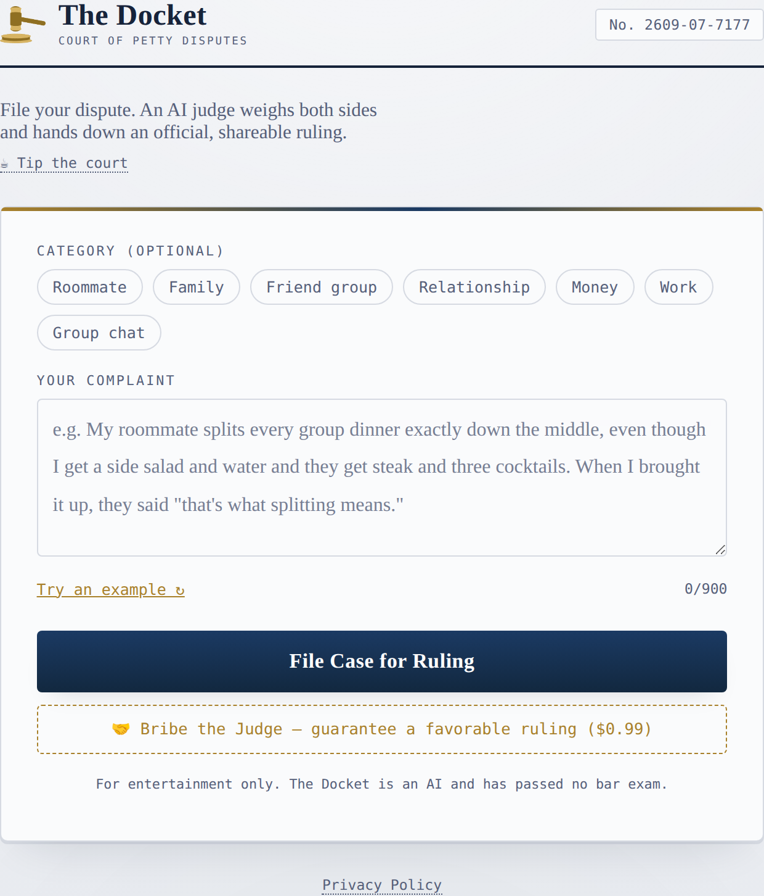
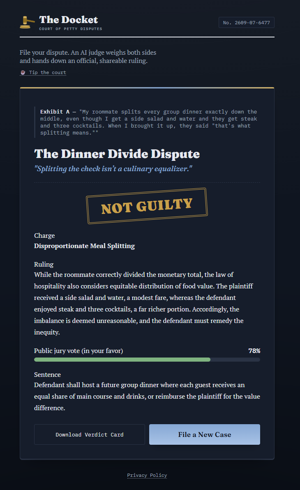

# ⚖️ The Docket

**An AI judge rules on your everyday disputes — fair, funny, and shareable.**

🔴 **Live site:** [thedocketapp.vercel.app](https://thedocketapp.vercel.app)

Got into a fight over who pays for what at dinner, whether "that's what splitting means," or who's wrong in the group chat? File your case, and an AI judge weighs both sides and hands down an official (satirical) ruling — charge, verdict, jury vote percentage, and sentence — styled like an old courtroom docket.

<table>
<tr>
<td></td>
<td></td>
</tr>
</table>

## Features

- **File a case** — pick an optional category, describe your dispute, get a ruling in seconds
- **AI-generated verdict** — a case title, charge, ruling, jury vote %, and sentence, written with dry courtroom wit
- **Download the verdict card** as a shareable PNG image
- **🤝 Bribe the Judge** — an optional $0.99 upsell that guarantees a favorable ruling, gated by real Stripe payment verification (not just an honor-system flag)
- **☕ Tip the court** — a Ko-fi tip jar for anyone who enjoys the site
- Mobile-optimized, light/dark theme aware

## How it's built (and how it's free)

The Docket is a static frontend + a single Vercel serverless function — no database, no backend server to maintain, no per-request cost:

- **Frontend:** plain HTML/CSS/JS, no framework or build step
- **AI rulings:** [Groq](https://groq.com)'s free-tier API (`openai/gpt-oss-120b`), called server-side so the API key never reaches the browser
- **Hosting:** [Vercel](https://vercel.com)'s free Hobby tier (static hosting + one serverless function)
- **Payments:** Stripe Payment Links, verified server-side via the Stripe API before granting the "bribe" outcome
- **Verdict image export:** [html2canvas](https://html2canvas.hertzen.com/), client-side, no server round-trip
- **Analytics:** Vercel Analytics

```
your-repo/
├── index.html          # the entire frontend
├── privacy.html         # privacy policy page
├── ads.txt               # AdSense authorization file
└── api/
    └── verdict.js        # serverless function — calls Groq, verifies Stripe payments
```

## Running your own copy

1. Fork/clone this repo and push it to your own GitHub account.
2. Import the repo into [Vercel](https://vercel.com/new) — no build configuration needed.
3. In Vercel's project settings, add an environment variable `GROQ_API_KEY` with a free key from [console.groq.com](https://console.groq.com).
4. (Optional, for the bribe feature) Create a Stripe Payment Link and add a `STRIPE_SECRET_KEY` environment variable.
5. Deploy. That's it — no database, no other config.

## Disclaimer

For entertainment only. The Docket is an AI and has passed no bar exam. Don't take its rulings, or this README, to actual small claims court.
